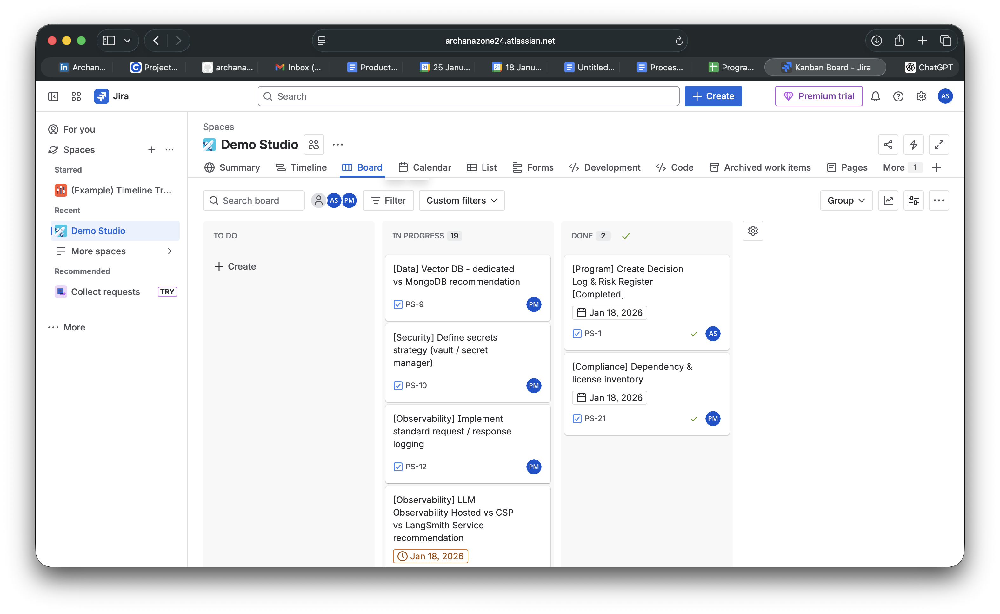

# demo-studio
AI-powered learning platform combining AI tutoring with human teaching for continuous feedback loops.

## Program Management Execution Snapshot
This Jira board demonstrates how I structure and execute a cross-functional technical program end-to-end, including planning, prioritization, decision tracking, risk management, and delivery across data, security, observability, and compliance workstreams.

